[< Back to README](../README)

PyCharm setup
-------------

If you are using pycharm, you can very easily automate your servers and celery workers run configuration.

:warning: You have to specify the sources root of your django project:
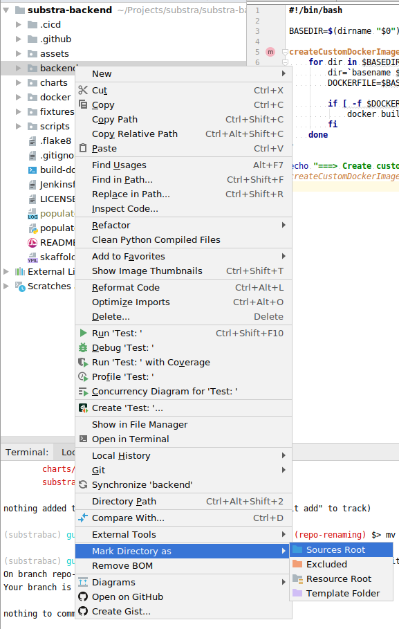

Enable Django support:
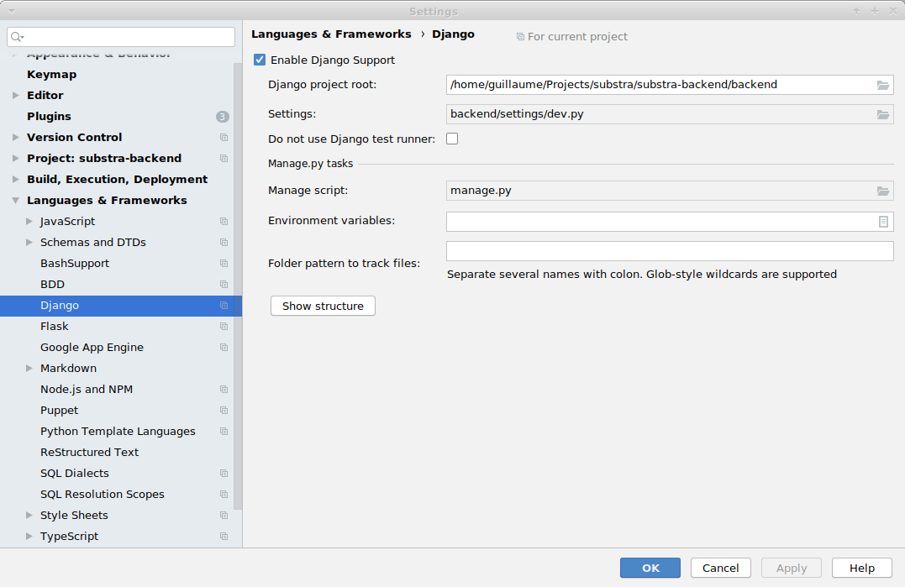

Use these configurations for easier debugging and productivity:

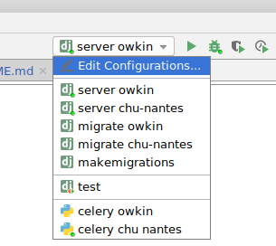

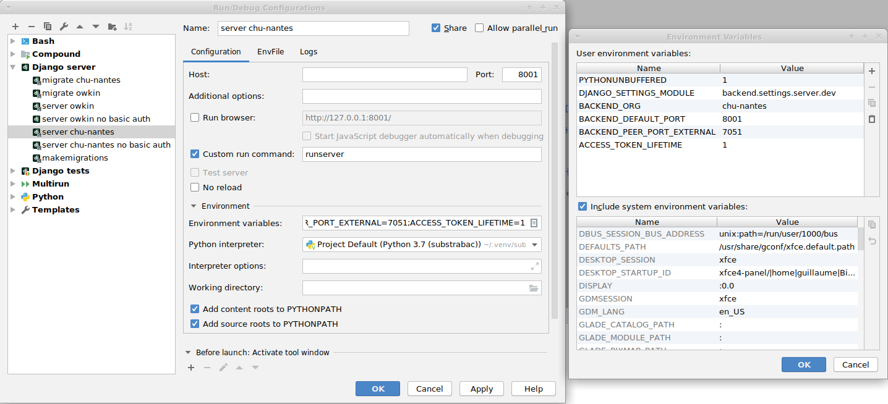
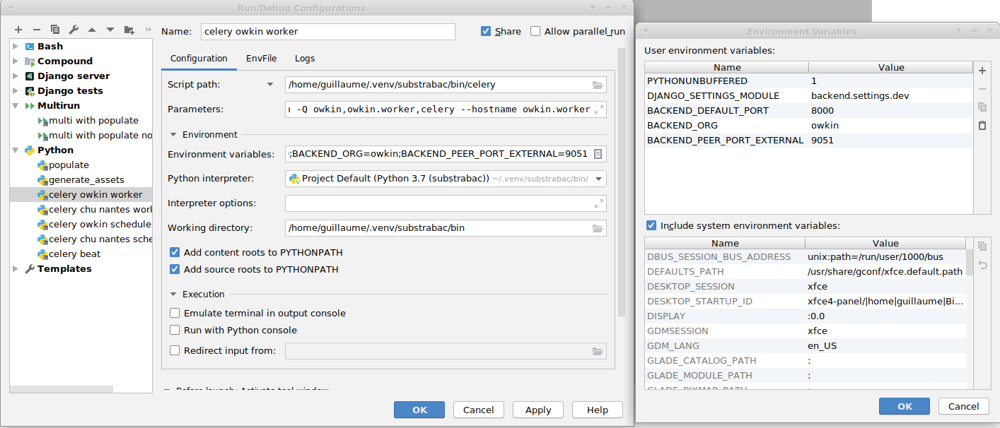
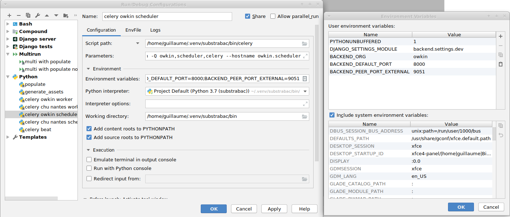

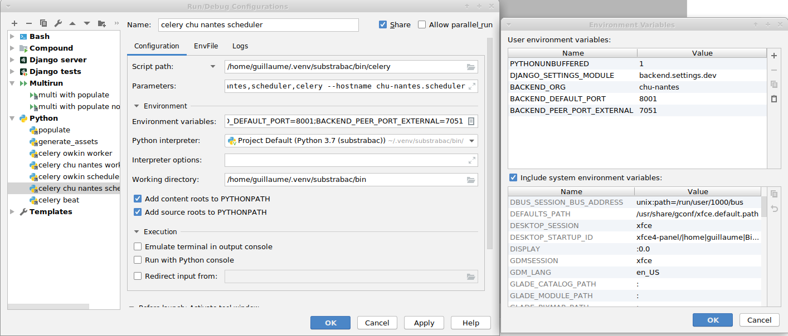
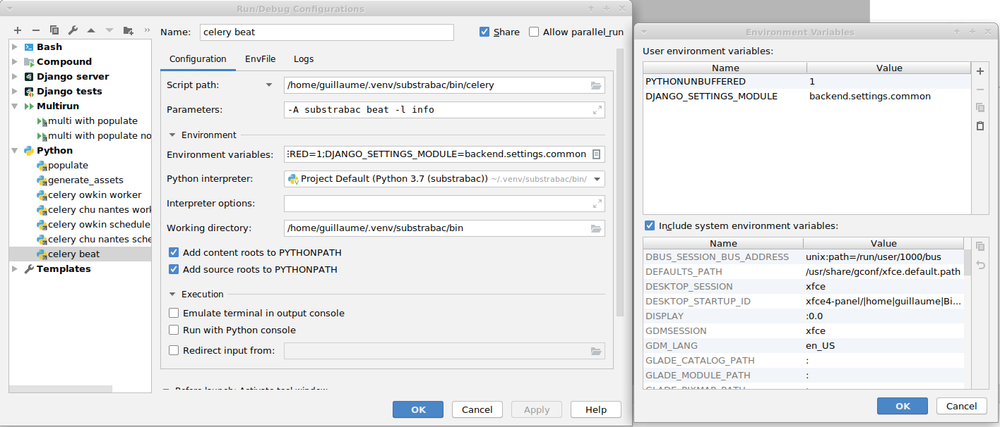

Do not hesitate to put breakpoints in your code. Even with periodic celery tasks and hit the `bug` button for launching your pre configurations.

You can even access directly to the databases (password is `backend` as described in the beginning of this document):
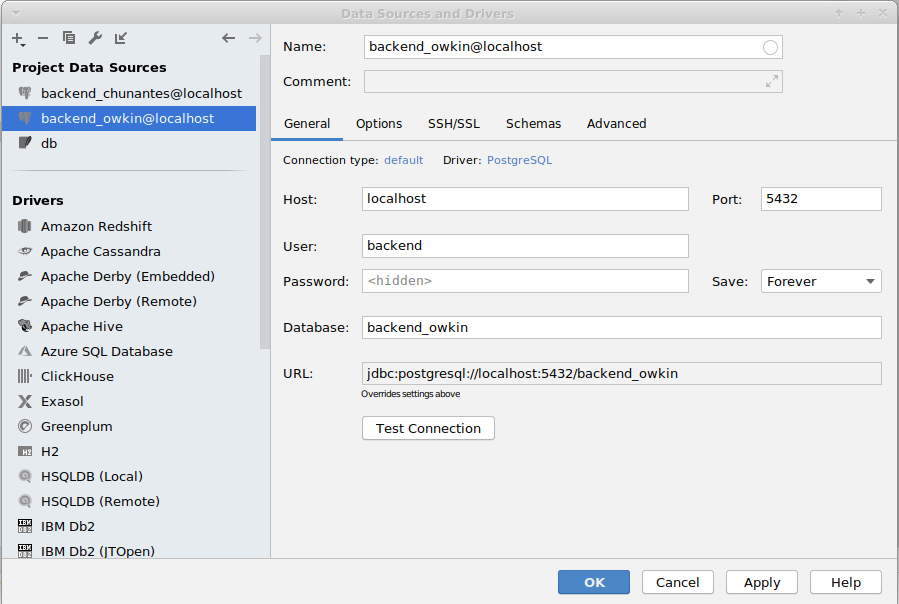
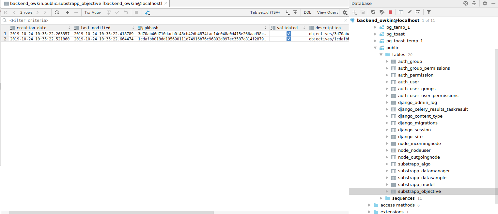

And for more convenience you can use the [multirun plugin](https://plugins.jetbrains.com/plugin/7248-multirun) from pycharm and configure it as:
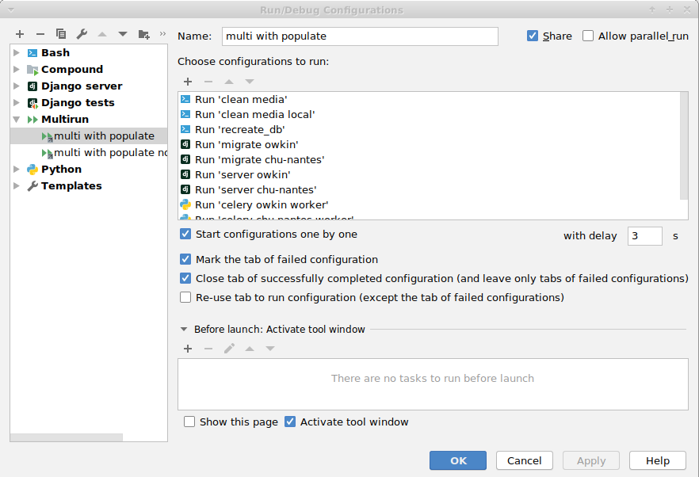
