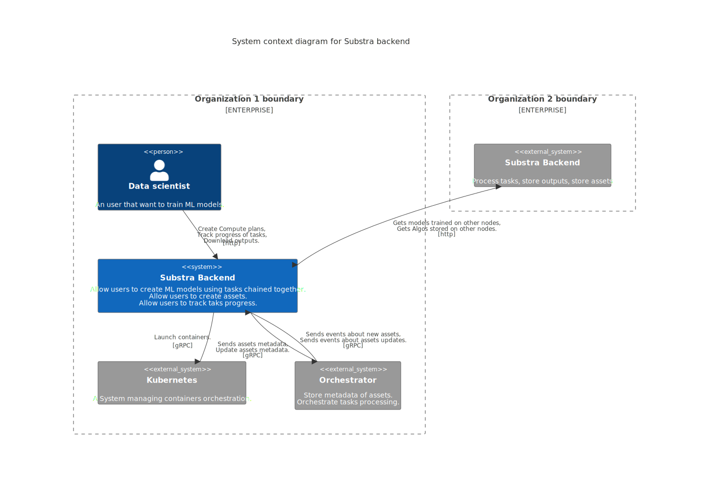

# Substra backend architecture
In this reference document we will present the Substra backend architecture.
The two main roles of the Substra backend are serving an API for the end users and processing compute tasks.

**Figure 1.** System context diagram for Substra backend.

In figure 1, you can see that the backend is the single point through which users interact with the system. You can also see that to perform its duty the backend needs to interact with several other systems:

- **Kubernetes.** To launch user-provided containers
- **The Orchestrator.** To share metadata with the whole network and retrieve tasks that it should perform.
- **Other Substra backends.** To download models computed in other organizations. To download Algorithms created by data scientists from other organizations.
