# Asset Buffer

## Background

"Compute Pods" are the Pods which execute Compute Tasks.

"Compute Tasks" consist of a user-defined Algorithm, as well as input Models and Datasamples.

"Asset" is a generic term which refers to Models, Data Samples, and Data Managers.

## Goals

The asset buffer makes assets available to Compute Pods in a manner that is **performant** and guarantees the **isolation** of tasks.

- **Isolation**. Assets are shared with Compute Pods using mounts. The mounted folders contain *only* the assets which are *necessary* for the execution of the Compute Task. As a result, it is impossible for an Algorithm to access assets it is not explicitly authorized to read. Since the mounts are read-only, it is also impossible for an Algorithm to modify existing assets.
- **Performance**. `task_dir` contains hard-links pointing to the asset buffer. Since creating hard-links is near instantaneous (<1ms), sharing assets with a compute-pod is very performant. This is to put in contrast with another approach which would involve _copying_ the assets from the asset buffer to the `task_dir` - which would be much slower.

See also the graph below for a visual explanation.

## Workflow

When a new Compute Task is received by the worker:

1. The asset buffer is populated. This step ensures that all the assets needed by the Compute Task are present in the asset buffer. The asset buffer is populated via file-system copy or download, depending on the asset type. For instance, data samples are only stored on the current organization's "datasamples" storage, so they are always *copied* from that storage. In contrast, models can have been produced by another organization, so they are typically *downloaded* from that other organization's backend server.
2. The `task_dir` folder is populated: we create hard links from the assets in the asset buffer to the `task_dir`.

You can see these two steps in action on this graph:

At the end of each Compute Task, `task_dir` is entirely cleared of all its contents, leaving a clean slate for the next task. When the next Compute Task is received, `task_dir` is populated again, using the 2 steps described above.
