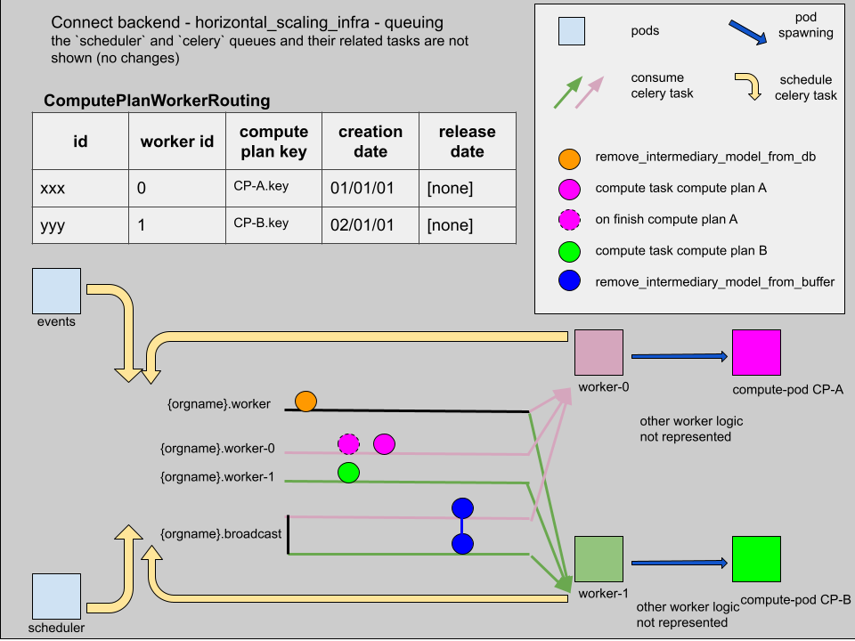

# Celery task queuing

## Background

Here are two features that triggered the need for a specific celery task queuing for the backend workers:
- the “one pod” feature: two tasks having the same compute plan id and the same dockerfile id are executed by the same compute pod. Hence situation 2.
- the "horizontal scaling" feature: it is possible to scale worker pods in order to schedule compute pods on different machines to have access to more compute resources. In the horizontal scaling implementation, each worker pod has its own asset buffer (subtuple persistent volume) which it shares with the compute pod it spawned.

## Problem to solve

We needed to implement a specific logic for distributing the celery tasks among the different workers:

- In order for “one pod” to work, all the tasks from the same compute plan using the same algo should be executed by the same worker.
  - Let’s have worker-A (on k8s node A), and worker-B (on k8s node B).
  - Worker-A spawns a compute-pod-C, which is scheduled on k8s node A and attached to subtuple-A.
  - Worker-B receives a compute task that will be executed on compute pod-C (one pod feature).
  - Worker-B gathers the input data in subtuple-B, then executes the task.
  - The task will be executed by compute-pod-C.
  - The compute-pod-C will look for the input data in subtuple-A, but they are in subtuple-B.
  - The task will not succeed because it can't access the data.

- The compute plan post processing (cleaning data), should be executed by the worker that executed the compute plan (in order to delete the data dirs in the right subtuple).

As a result: **it is necessary to bind compute tasks and post processing tasks that use a compute pod to the worker that spawned that pod.**

## Solutions implemented

### post processing, prepare and compute tasks

We put together a mechanism to make sure that **"tasks belonging to one compute plan are always scheduled on the worker on which a compute pod for this compute plan is running"**.

This implies:
- having one Celery task queue that is specific to a single worker: worker `i` listens to queue `{orgname}.worker-{i}`.
- in order to keep track of which compute plan is scheduled on which worker, introducing a new table in the PostgreSQL database: `ComputePlanWorkerMapping`. The compute plans are identified by a compute plan key. The workers are identified by the index of their replica.

Here is the algorithm to route a compute plan on a worker:
- get the workers on which there are the least CP routed at the moment
- get the first of these workers (according to their replica index).

Why getting the "first of these workers"?
- This can be useful when managing statefulsets: as worker pods are controlled by statefulsets, when scaling workers down we have to shut down first the higher indexes. This algorithm maximizes the chances for the workers with a lower index to be busier - so the ones with the higher index are more likely to be free and can be switched off.
- Plus this makes the algorithm process deterministic, and it makes troubleshooting easier.

When a compute plan is finished, the compute pod is removed and a release date is added to the specific mapping line in `ComputePlanWorkerMapping`. The CP is not routed to the worker anymore. If a new task is scheduled on this compute plan, as the compute pod was removed, we can re-create a new compute pod on any worker. A new routing is created in `ComputePlanWorkerMapping`. So a compute plan may be executed on different workers, but only one at a time.

### remove_intermediary_models_from_buffer tasks

Regarding events that remove the intermediary models from buffer (`remove_intermediary_models_from_buffer`), the intermediary models can be on multiple workers as the compute plan may have been executed on different workers. So this event is sent to all workers, via a [`celery broadcast`](https://docs.celeryproject.org/en/stable/userguide/routing.html#broadcast).

### remove_intermediary_models_from_db tasks

This celery task is not specific to the asset buffer or the compute pod: it modifies entries in the postgresql database. So it can be executed by any worker.

It is then scheduled on the generic worker queue, which is listened by all the workers.

### Synthesis

Below are summarized the Celery tasks queues for `n` workers (we will not mention the `scheduler` and `celery` Celery task queues and their related tasks, for which there were no changes):
- the generic worker queue: `{orgname}.worker`, listened to by all workers, will be executed by one of the workers
- the worker queue `{i}`: `{orgname}.worker-{i}` for `i` from `0` to `n`, listened to by `worker-{i}`, will be executed by worker i
- the broadcast worker queue: `{orgname}.broadcast` listened to by all workers, will be executed by all workers

Here are the Celery task queues on which each task can be scheduled:

| task  | Celery task queue  | comment  |
|---|---|---|
| `delete_cp_pod_and_dirs_and_optionally_images` | `{orgname}.worker-{i}` | if a mapping exists otherwise the task will not be scheduled|
|`prepare_task`|`{orgname}.worker-{i}`|In order to determine which worker `{i}` to schedule on: using an existing entry of `ComputePlanWorkerMapping` or by creating one if none exists|
|`compute_task`| `{orgname}.worker-{i}`| it uses the same queue as the one used by `prepare_task` for the same compute task |
|`remove_intermediary_models_from_db`|`{orgname}.worker`||
|`remove_intermediary_models_from_buffer`|`{orgname}.broadcast`||

source: https://docs.google.com/drawings/d/1b2NZ1AUTcK7HKiF7oPoakqbkQXP1mHSVHjUWZqtIiYk/edit
