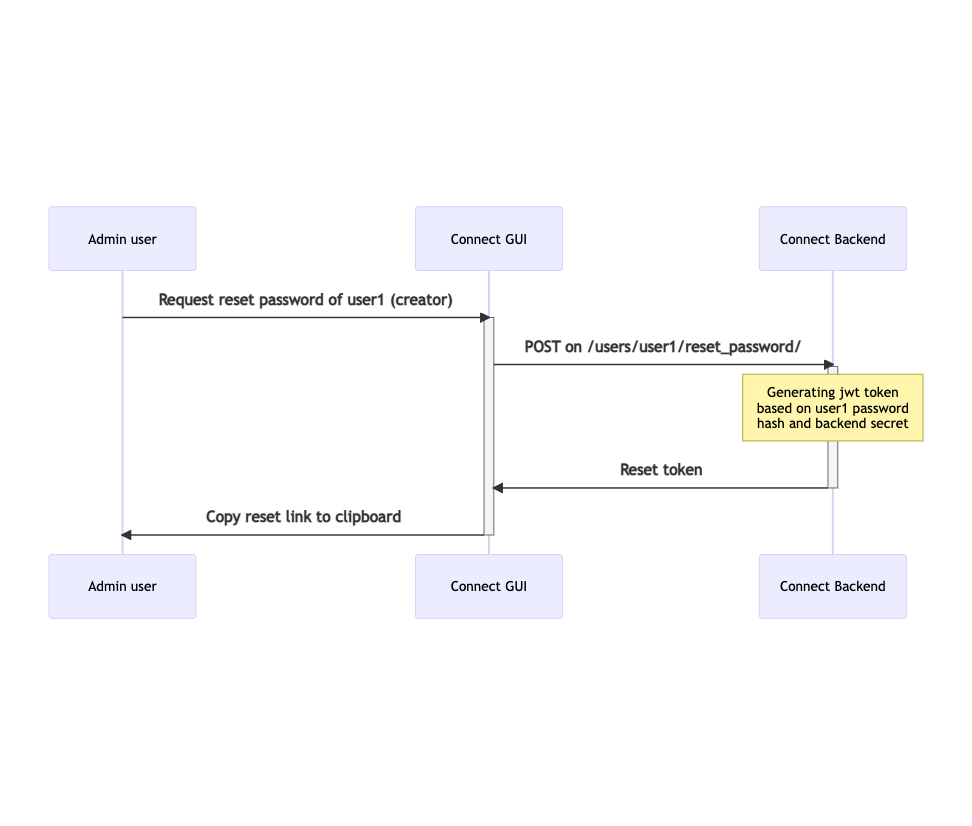
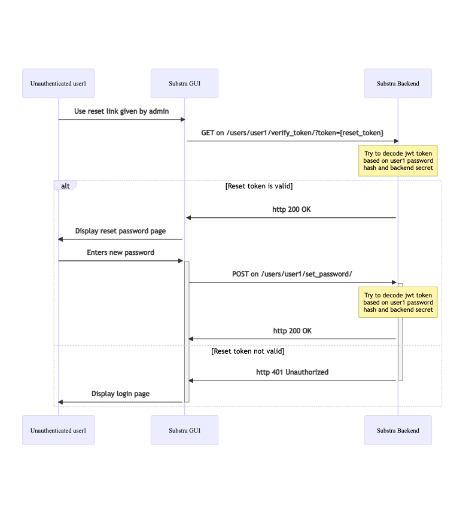

# User management

## Problem to solve

User creation could only be made during deployment of connect or by SRE action, and there was only one layer of privileges. We needed a proper user management mechanism with different roles for different privileges and ability to add/modify existing users. It was also necessary to allow a user to request a reset of password if forgotten.

## Solutions implemented

- User creation through account operator settings (`addAccountOperator.users`) is still necessary to at least create the first user. Users added through this command will have administrators role and privileges.

- An admin user can then create / delete users and modify the role of existing user

- An authenticated user can modify its own password

- A user can request a reset password link from his administrator.

#### API

Allow admin user to request a reset password token for any user
`POST` on `/users/{username}/reset_password/`
Returns reset token

Allow unauthenticated user to verify reset token
`GET` on `/users/{username}/verify_token/?token={token}`
Returns `http 200` if token is valid, `401` otherwise.

Allow unauthenticated user to set new password
`POST` on `/users/{username}/set_password/`
Body : `{"token" : {token}, "password": {new_password}}`

Allow user to modify their own password (user must be authenticated)
`PUT` on `/users/{username}/password/`
Body : `{"password": {new_password}}`

## Reset password security

When a reset password request is sent, we generate a jwt token based on current password hash and backend secret key and a 7 day validity.

- The current password hash makes sure of the unique use of a reset link: once the password is changed all reset links generated before the change are invalidated.

- The backend secret key makes sure that only the backend can decode the token and when the key is rotated, invalidating all current sessions, all unused reset token are invalidated as well.

- If a reset token is not used within 7 days, it is invalidated.
