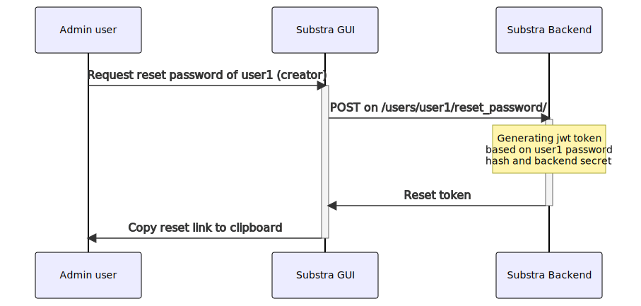
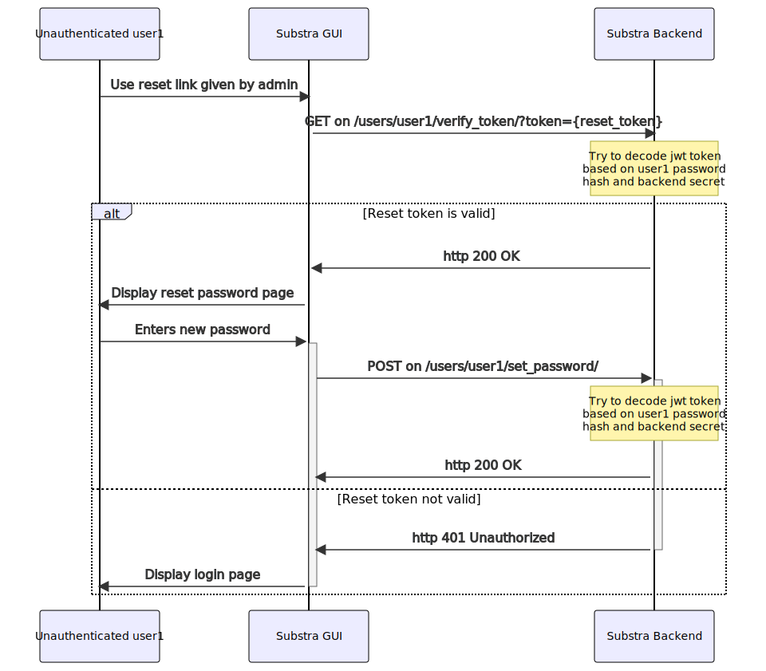

# User management

## User creation at deploy time

User creation through account operator settings (`addAccountOperator.users`) is necessary to at least create the first user. Users added through this command will have administrators role and privileges.

## User management at runtime

- An admin user can create or delete users and modify the role of existing users.
- An authenticated user can modify its own password.
- A user can request a reset password link from their administrator.

### API

Allow admin user to request a reset password token for any user
`POST` on `/users/{username}/reset_password/`
Returns reset token

Allow unauthenticated user to verify reset token
`GET` on `/users/{username}/verify_token/?token={token}`
Returns `http 200` if token is valid, `401` otherwise.

Allow unauthenticated user to set new password
`POST` on `/users/{username}/set_password/`
Body : `{"token" : {token}, "password": {new_password}}`

Allow user to modify their own password (user must be authenticated)
`PUT` on `/users/{username}/password/`
Body : `{"password": {new_password}}`

#### Reset password security

When a reset password request is sent, we generate a jwt token based on current password hash and backend secret key and a 7 day validity.

- The current password hash makes sure of the unique use of a reset link: once the password is changed all reset links generated before the change are invalidated.

- The backend secret key makes sure that only the backend can decode the token and when the key is rotated, invalidating all current sessions, all unused reset token are invalidated as well.

- If a reset token is not used within 7 days, it is invalidated.

## External users

Substra can accept external users through OpenID Connect (OIDC), providing Single Sign-on (SSO).

At first login, a user is created that corresponds to the external user. This new user has no password.
